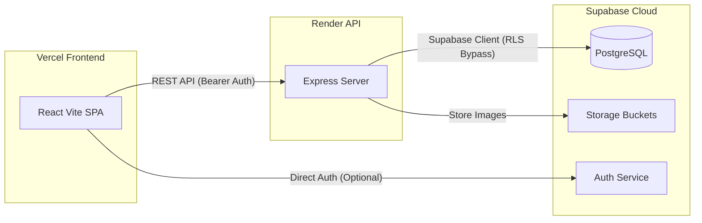

# 🚀 RentaHub Deployment Guide (Vercel & Render)

This guide walks you through deploying the complete full-stack **RentaHub** application using **Supabase** (Database), **Render** (Node.js Express Backend), and **Vercel** (React Vite Frontend).

---

## 🏛️ System Architecture



---

## 1. 🗄️ Database Setup (Supabase)

Since RentaHub uses Supabase for database storage, authentication, and file buckets, you must initialize your database schema and storage buckets first.

1. **Create a Supabase Project**:
   - Go to [supabase.com](https://supabase.com) and sign in.
   - Create a new project. Select a region close to your target users.
   - Note down your **Database Password**.

2. **Run the Database Schema**:
   - Go to the **SQL Editor** tab in your Supabase dashboard.
   - Click **New Query**.
   - Copy the entire contents of the `supabase/schema.sql` file in this repository and paste it into the editor.
   - Click **Run** to create all tables, views, and row-level security (RLS) rules.

3. **Configure Storage Buckets**:
   - Go to the **Storage** tab in Supabase.
   - Click **New Bucket**.
   - Name the bucket `bill-images`.
   - Set the bucket to **Public** (so that image URLs are accessible to the client).
   - Click **Create**.

4. **Create Your Admin Account**:
   - Go to **Authentication > Users** in the Supabase dashboard.
   - Click **Add User** > **Create User**.
   - Input your email and a password. Click **Save**.
   - Copy the newly generated **User ID** (UUID) for this user.
   - Return to the **SQL Editor**, open a new query, and run:
     ```sql
     INSERT INTO admin_profiles (auth_user_id, full_name, email, role)
     VALUES ('<YOUR_COPIED_USER_ID>', 'Admin User', 'your-email@example.com', 'super_admin');
     ```
     *(Replace `<YOUR_COPIED_USER_ID>` and `your-email@example.com` with your actual User ID and email address).*

---

## 2. 🎛️ Backend Deployment (Render)

We host the Express server on Render as a **Web Service**.

1. **Push your code to GitHub**:
   - Ensure your local Git repository is pushed to a GitHub repository (public or private).

2. **Create Render Web Service**:
   - Sign in to [render.com](https://render.com).
   - Click **New +** and select **Web Service**.
   - Connect your GitHub repository.
   - Configure the following settings:
     * **Name**: `rentahub-api` (or any custom name)
     * **Region**: Choose the same region as your Supabase database.
     * **Branch**: `main` (or your active branch)
     * **Root Directory**: `server` (⚠️ *Very Important: This tells Render to run commands inside the server subfolder.*)
     * **Runtime**: `Node`
     * **Build Command**: `npm install && npm run build`
     * **Start Command**: `npm run start`

3. **Set Environment Variables**:
   - Click the **Environment** tab on Render.
   - Add the following environment variables:

| Key | Value | Description |
|:---|:---|:---|
| `NODE_ENV` | `production` | Enables production mode |
| `SUPABASE_URL` | *Your Supabase project URL* | Found in Supabase Settings > API |
| `SUPABASE_ANON_KEY` | *Your anon/public key* | Found in Supabase Settings > API |
| `SUPABASE_SERVICE_ROLE_KEY` | *Your service role key* | Found in Supabase Settings > API (Keep secret!) |
| `CLIENT_URL` | `http://localhost:5173` | *Temporarily set to localhost; we will update this to your Vercel URL in Step 4.* |

4. **Deploy the Service**:
   - Click **Create Web Service**.
   - Wait for the build and deployment process to complete.
   - Once completed, copy the **Render service URL** shown at the top of the page (e.g., `https://rentahub-api.onrender.com`).
   - You can test if it is running by visiting: `https://<your-render-name>.onrender.com/api/health`.

---

## 3. 🖥️ Frontend Deployment (Vercel)

We deploy the React frontend on Vercel.

1. **Create Vercel Project**:
   - Sign in to [vercel.com](https://vercel.com).
   - Click **Add New** > **Project**.
   - Import your GitHub repository.

2. **Configure Project Settings**:
   - **Root Directory**: Click "Edit" and select **`client`** (⚠️ *Very Important: This tells Vercel to build the React application inside the client subfolder.*)
   - Vercel will automatically detect **Vite** as the framework preset and configure the Build and Output settings:
     * *Framework Preset*: `Vite`
     * *Build Command*: `npm run build` (or `vite build`)
     * *Output Directory*: `dist`

3. **Set Environment Variables**:
   - Expand the **Environment Variables** section.
   - Add the following variable:

| Key | Value | Description |
|:---|:---|:---|
| `VITE_API_URL` | `https://<your-render-name>.onrender.com/api` | The URL of your Render backend API (ensure it ends with `/api` and has no trailing slash). |

4. **Deploy**:
   - Click **Deploy**.
   - Once the deployment finishes, Vercel will give you a public URL (e.g., `https://rentahub-client.vercel.app`).

> [!NOTE]
> We have preconfigured a `client/vercel.json` file in the codebase. This file handles Single Page Application (SPA) routing redirections, ensuring that reloading your web browser on sub-pages (e.g., `/dashboard` or `/login`) does not trigger a 404 error page.

---

## 4. 🔗 Finalize CORS Handshake

To prevent the browser from blocking requests between your frontend and backend (due to Cross-Origin Resource Sharing restrictions), you must allow the Vercel frontend URL to request the Render backend.

1. Copy your Vercel frontend URL (e.g., `https://rentahub-client.vercel.app`).
2. Go to your **Render Dashboard** and open your backend service (`rentahub-api`).
3. Click on the **Environment** tab.
4. Locate the `CLIENT_URL` environment variable and change its value to your Vercel frontend URL:
   * **`CLIENT_URL`** = `https://rentahub-client.vercel.app`
5. Save the changes.
6. Render will automatically redeploy the service with the updated environment.

**🎉 Congratulations! Your Rental Management SaaS is now live and fully connected.**
